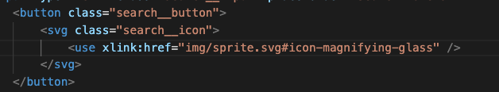
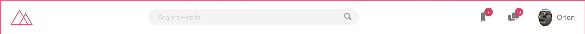

# Project to practice Flexbox

This project is the property of Jonas Schmedtmann. Original git repository: https://github.com/jonasschmedtmann/advanced-css-course

Project is from Udemy Course: The most advanced and modern CSS course on the internet: master flexbox, CSS Grid, responsive design, and so much more.

Creating a git repository to practice and learn advanced CSS, especially Flexbox.
Documenting the journey along the way to build muscle memory. 

## Project Overview

* Practice and improve Flexbox
* To build a user interface for a Travel Booking company (no functionality)

## Getting Started

1. ``npm install``
2. ``npm run start``

____

## Initial Project Architecture

**Setting up scss files**
* _components.scss
* _base.scss
* _layout.scss

**Global Settings**

* Working with rem, rather than pixels. 
* Use of CSS Variables or custom properties.

## Screenshots

**Initial gradient background**

**Adding in SVG Icons**

**Header - Using flexbox**

- Input field expands to 100% and changes colour to a darker grey
- Hover on Bookmarks, Chat and User Image

____

## Learnings

**Inital set up**
* Review the package.json file for developer depencenies. Some of these were outdated. Found the latest version. 
* Make a change in the main.scss file. the css/style.css file should reflect the changes if watch is working as expected.

